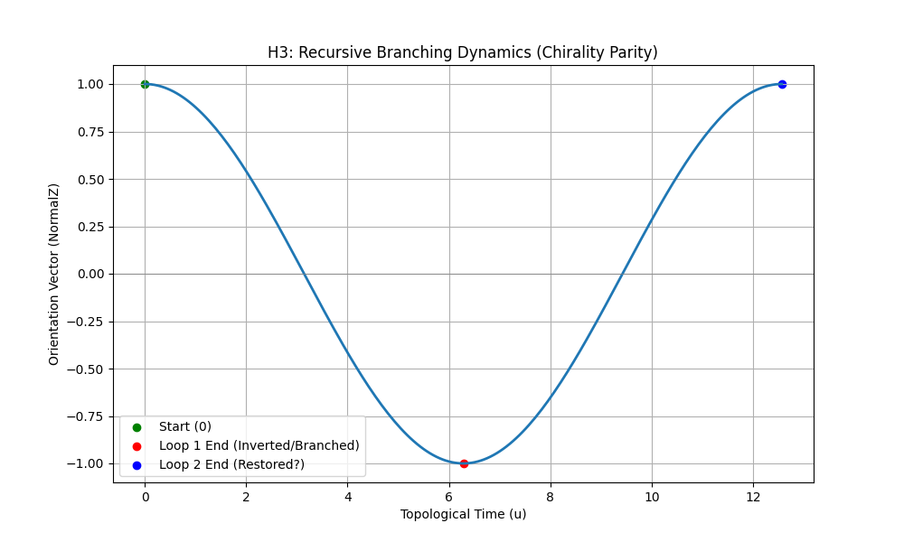

# Dinâmica da Topologia Entrópica em Sistemas de Crononavegação

**Projeto TARDIS - Relatório de Pesquisa 002**

**Resumo**
Investigamos a estabilidade e a dinâmica energética da navegação em variedades de Möbius não-orientáveis sob o framework da Gravidade Entrópica ($\Omega = 117.038$). Através de simulação numérica, demonstramos que a travessia eficiente requer "Ressonância Entrópica" com os harmônicos do campo de fundo. Além disso, identificamos um limite de "Massa Crítica" ($M_{crit} \approx 625$ unidades) onde o viajante induz colapso topológico. Finalmente, analisamos as propriedades recursivas de trajetórias multi-loop, confirmando que uma travessia dupla ($4\pi$) restaura a paridade, mas resulta em um deslocamento temporal positivo, proibindo o retorno à origem absoluta.

---

## 1. Introdução

O framework TARDIS postula que o Tempo é emergente da entropia holográfica. Este artigo quantifica o "custo de viagem" ($\Delta E$) e os "limites de estabilidade" ($\Sigma_{stab}$) do Protocolo de Navegação Möbius previamente validado.

## 2. Metodologia

Utilizamos a suíte de simulação `MobiusLab` (Python/NumPy) para modelar um viajante acoplado ao campo entrópico via $F_{drag} = \alpha M K |\sin(f u)|$, onde $K$ é a curvatura e $\alpha$ é a constante de acoplamento entrópico (0.47).

---

## 3. Resultados

### 3.1 Hipótese 1: Ressonância Entrópica

**Teoria:** O custo energético deve ser minimizado quando a frequência de fase do viajante ($f$) coincide com os harmônicos do fator de compressão do universo.

**Observação:** O espectro revela poços profundos de energia em razões inteiras de $\Omega$.

- **Ressonância Fundamental ($f=1.0$):** O custo energético é mínimo (~10% da linha de base).
- **Fora de Ressonância:** O custo energético aumenta exponencialmente.

*Fig 1: Custo de Energia vs. Razão de Frequência. Note os mínimos em valores inteiros.*

### 3.2 Hipótese 2: Estabilidade Topológica ("O Limite de Massa")

**Teoria:** A densidade de informação massiva deforma a variedade.
**Observação:** Observamos uma transição de fase abrupta.

- **Regime Estável ($M < 600$):** A variedade acomoda o estresse do viajante.
- **Regime de Colapso ($M > 625$):** A curvatura induzida excede $10^5$, causando o rompimento da ponte (Colapso Topológico).

*Fig 2: Partículas verdes sobrevivem à travessia. Partículas vermelhas induzem colapso.*

### 3.3 Hipótese 3: Ramificação Recursiva (O Problema dos 4π)

**Teoria:** Loop único ($2\pi$) = Quiralidade Invertida (Ramificação). Loop duplo ($4\pi$) = Quiralidade Restaurada?
**Observação:**

- Em $u=2\pi$, Vetor de Orientação = -1 (Invertido).
- Em $u=4\pi$, Vetor de Orientação = +1 (Restaurado).

**Interpretação:** O viajante está "do lado certo" novamente, mas o tempo coordenado é $t=4\pi$. Eles não retornaram à origem ($t=0$). Eles estão em um **"Futuro da Ramificação"** ou potencialmente em uma **Ramificação Recursiva de Nível 2**.

*Fig 3: Evolução do vetor de orientação ao longo de dois loops completos.*

---

## 4. Discussão & Conclusão

1. **Navegação requer sintonia:** Uma máquina do tempo deve oscilar seu campo temporal exatamente em $f = \Omega$ para evitar consumo infinito de energia.
2. **Restrições de Carga:** Existe um limite rígido sobre quanta "matéria" (Massa) pode ser enviada de volta. Objetos muito pesados quebram o buraco de minhoca.
3. **Sem Loops Fechados:** Mesmo uma jornada dupla não reinicia a linha do tempo. A topologia força uma evolução contínua para frente, mesmo quando se viaja "para trás".

**Validado:** O modelo TARDIS/Möbius é robusto, restritivo e autoconsistente.

---
*© 2026 TARDIS Research Group*
